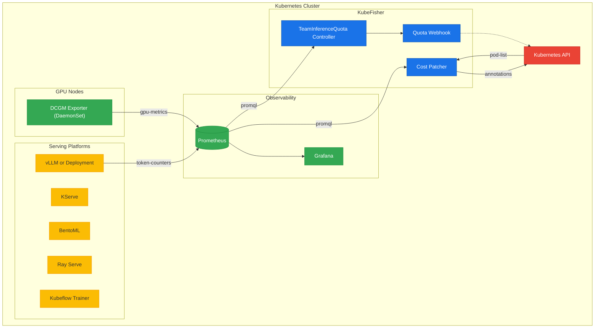
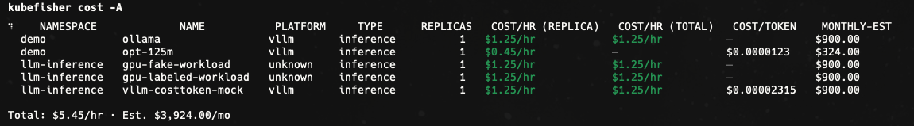
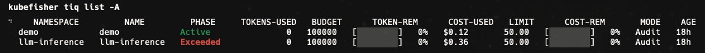
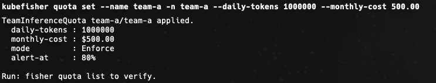
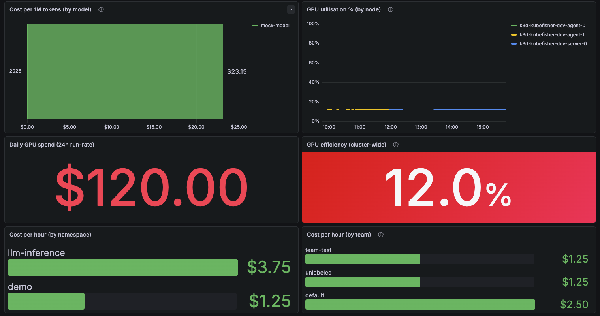

# KubeFisher

**KubeFisher is a Kubernetes-native AI governance platform that provides GPU cost attribution, cost-per-token visibility, team budgets, and quota enforcement for AI workloads.**

Works with any inference stack on Kubernetes (KServe, vLLM, BentoML, Ray, Triton, plain Deployments). KubeFisher does not replace your serving platform — it governs GPU spend across all of them.

[](https://github.com/m2khosravi/kubefisher/actions/workflows/ci.yml)
[](LICENSE)
[](go.mod)

---

## How it works



KubeFisher sits **below** serving frameworks at the Kubernetes + DCGM + Prometheus governance layer. The cost-patcher reads GPU usage from Prometheus, joins it against a configurable pricing table, and writes `kubefisher.io/cost-per-hour-per-replica`, `kubefisher.io/cost-per-hour-total`, and `kubefisher.io/cost-per-token` annotations onto top-level workload owners every 30 s. The `TeamInferenceQuota` operator reads the same Prometheus data and can block new GPU pods the moment a team exceeds its budget.

See [`docs/contract.md`](docs/contract.md) for the full label/annotation/metric schema.

### In action

**GPU cost attribution — `kubefisher cost -A`**
> Per-workload cost/hr, cost/token, and monthly estimate across all namespaces.



**Team quota status — `kubefisher tiq list -A`**
> Live token budget, cost used, and quota mode per team.



**Set a quota — `kubefisher quota set`**
> Apply a daily-token and monthly-cost limit for a team in one command.



**Grafana dashboard — cost, GPU utilisation & daily spend**
> Pre-built panels: cost/1M tokens by model, GPU utilisation % by node, daily GPU spend (24 h run-rate), GPU efficiency cluster-wide, cost/hr by namespace and by team.



---

## Quickstart — local demo (≈10 min, no GPU required)

```bash
git clone https://github.com/m2khosravi/kubefisher && cd kubefisher
make cluster-up          # k3d + Prometheus (~5 min)
make kubefisher-build    # bin/kubefisher CLI
bash hack/demo.sh        # cost table + quota demo
```

Full guide: [`docs/getting-started.md`](docs/getting-started.md) · FAQ: [`docs/faq.md`](docs/faq.md)

---

## Installing on a real cluster

Prerequisites: **cluster-admin** · **cert-manager** · **kube-prometheus-stack** · Kubernetes ≥ 1.25

> The default gpu-pricing ConfigMap matches k3d fake labels (`accelerator=nvidia-a10g`).
> Edit it for your real node labels before installing — see
> [`configs/gpu-pricing.example.yaml`](configs/gpu-pricing.example.yaml) and
> [`docs/getting-started.md#installing-on-a-real-cluster`](docs/getting-started.md#installing-on-a-real-cluster).

```bash
helm install kubefisher ./charts/kubefisher \
  -n kubefisher-system --create-namespace \
  --set operator.enabled=true \
  --set operator.webhook.enabled=true \
  --set-file gpuPricing.pricing=my-pricing.yaml \
  --set config.prometheusUrl=http://<prometheus-svc>.<ns>.svc:9090 \
  --set observability.serviceMonitor.additionalLabels.release=<stack-release> \
  --set observability.prometheusRule.additionalLabels.release=<stack-release> \
  --wait

# Activate enforcement per namespace
kubectl label namespace <team-ns> kubefisher.io/quota-enforcement=enabled
```

> Images are pulled from `ghcr.io/m2khosravi/kubefisher/`. A published release tag must
> exist — see [`docs/releasing.md`](docs/releasing.md), or use `edge` (latest main build).

---

## Core capabilities

| Capability | Detail |
|---|---|
| **GPU cost/hr** | Per-replica and fleet-total cost via DCGM + Prometheus + list pricing |
| **Cost/token** | Best-effort, vLLM only — requires rising `vllm:prompt_tokens_total` + `vllm:generation_tokens_total` |
| **TeamInferenceQuota** | CRD + operator: 60 s reconcile, phase transitions (Active → Warning → Exceeded), blocks GPU pods in Enforce mode |
| **kubefisher CLI** | `install`, `cost`, `deploy`, `status`, `logs`, `quota` — platform-agnostic |
| **Helm chart** | `charts/kubefisher/` — cost-patcher, operator, CRD, recording rules, Grafana dashboard |
| **Grafana dashboard** | Team budget utilization, quota phase, cost/token, GPU utilisation, cost/hr by namespace and team |

---

## Known limitations

- **Cost/token** only works with vLLM and requires the `5m` rate window to elapse (configurable via `costPatcher.tokenRateWindow`). Flat counters produce `—`.
- **List pricing only** — does not account for spot discounts, reservations, or actual utilisation (reserved GPU capacity is billed).
- **GPU efficiency** is cluster-wide only; per-namespace breakdowns are not yet available.
- **Real DCGM** requires NVIDIA drivers + hardware. Local dev uses `dcgm-mock`.
- **Webhook fails open** (`failurePolicy: Ignore`) when the operator is down — see [`docs/security.md`](docs/security.md).
- **TeamInferenceQuota is namespace-scoped** — no cross-namespace aggregation yet.

---

## Repo layout

| Path | Role |
|---|---|
| `charts/kubefisher/` | Helm chart — canonical install path |
| `cmd/kubefisher/` | CLI entrypoint |
| `cmd/cost-patcher/` | Cost-patcher entrypoint |
| `internal/costpatcher/` | Reconcile loop, platform adapters, pricing |
| `internal/cli/kubefisher/` | All CLI commands (Cobra + client-go) |
| `operator/` | TeamInferenceQuota kubebuilder operator (nested Go module) |
| `build/cost-patcher/` | Dockerfile for cost-patcher |
| `configs/` | `gpu-pricing.example.yaml` and other config templates |
| `docs/` | Full documentation |

---

## Docs

| Document | Description |
|---|---|
| [`docs/getting-started.md`](docs/getting-started.md) | First-time guide — local demo + real cluster install |
| [`docs/cli.md`](docs/cli.md) | Full CLI reference |
| [`docs/cost-patcher.md`](docs/cost-patcher.md) | Cost model, platform adapters, recording rules |
| [`docs/contract.md`](docs/contract.md) | Labels, annotations, metrics, pricing schema |
| [`docs/teaminferencequota-operator.md`](docs/teaminferencequota-operator.md) | TeamInferenceQuota CRD and reconciler |
| [`docs/verify-quota.md`](docs/verify-quota.md) | 5-command enforcement verification runbook |
| [`docs/security.md`](docs/security.md) | Webhook policy, TLS, RBAC |
| [`docs/cluster-dev.md`](docs/cluster-dev.md) | k3d local cluster dev workflow |
| [`docs/grafana-dashboard.md`](docs/grafana-dashboard.md) | Grafana dashboard setup and panels |
| [`docs/releasing.md`](docs/releasing.md) | Release process and image publishing |
| [`docs/faq.md`](docs/faq.md) | Common questions and fixes |
| [`CONTRIBUTING.md`](CONTRIBUTING.md) | Build, test, add adapters, open a PR |

---

## Contributing

See [`CONTRIBUTING.md`](CONTRIBUTING.md).

## License

Apache 2.0 — see [LICENSE](LICENSE).

